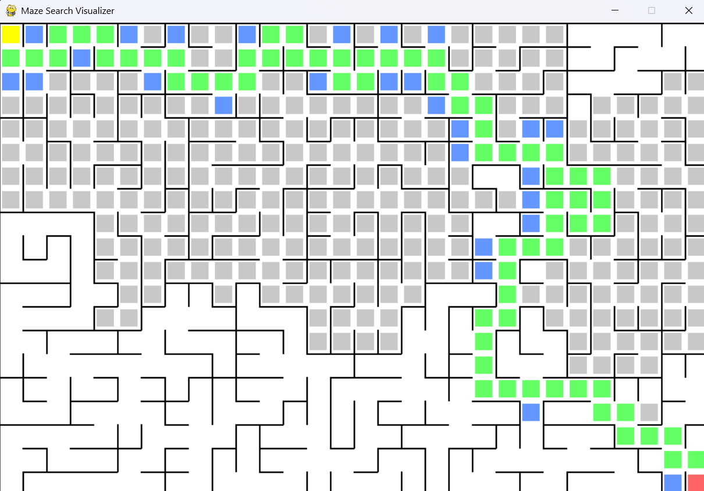
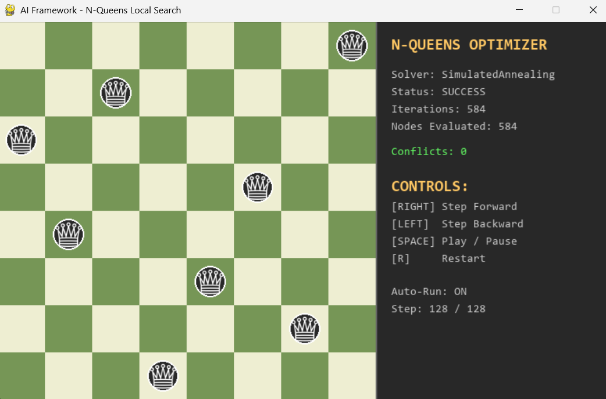

# 🚀 Advanced Agentic AI Lab

A state-of-the-art, highly modular Object-Oriented AI library implemented from scratch in Python. This Lab provides unified abstractions, pluggable solver engines, automated 30-run benchmarking pipelines, performance chart generators, and an interactive Pygame Launcher Hub for a vast array of artificial intelligence paradigms.

---

## 🎮 Unified Interactive Launcher Hub (`main.py`)

Launch the unified resizable Pygame GUI to browse, configure, and play across all **17 supported AI domains**:

```bash
python main.py
```

### Features of the Launcher Hub:
* **Category Tabs**: Seamlessly switch between **Search**, **Optimization**, **CSP**, and **Adversarial Games**.
* **Algorithm Selector**: Pick any algorithm dynamically (A*, BFS, DFS, UCS, IDA*, Hill Climbing, Simulated Annealing, Genetic Algorithm, Backtracking + MRV/MAC, Minimax, AlphaBeta, MCTS).
* **Game Modes**: Human vs AI, AI vs AI, Human vs Human.
* **Parameter Tuning**: Adjust search depth, MCTS simulations, or grid sizes on the fly.
* **Dynamic Window Resizing**: Full `pygame.RESIZABLE` support across all visualizers.

---

## 📸 Visualizer & Algorithm Screenshots

| Maze Pathfinding (A* & IDA*) | Sokoban Box Pushing Search |
|---|---|
|  |  |

| N-Queens Local Optimization (Simulated Annealing) | N-Puzzle Sliding Tile Search |
|---|---|
|  |  |

---

## 🛠️ Educational Modules, Demos & Experimentation Folders

This Lab is built for hands-on learning, experimentation, and research. Different entry points allow you to explore algorithms in isolation without removing or altering core solver logic:

- **`demo/` Directory (Standalone Executable Demos)**:
  Contains ready-to-run educational scripts demonstrating individual algorithms step-by-step:
  - `demo/nqueens_demo.py` & `demo/genetic_algorithm_nqueens.py` (Local search & GA on N-Queens)
  - `demo/beam_search_nqueens.py` (Local Beam Search with k=5)
  - `demo/sokoban_demo.py` (Procedurally generated Sokoban solver with A*)
  - `demo/crazy_demo.py` (Crazy Card Game self-play simulation with Obssa's Heuristic)
  - `demo/pattern_database_demo.py` (Disjoint Pattern Database precomputation for 8/15 puzzle)

- **`visualization/` Directory (Pygame Graphical Visualizers)**:
  Dedicated visualizer modules for step-by-step graphical rendering:
  - `MazeVisualizer.py`, `NPuzzleVisualizer.py`, `RomanianMapVisualizer.py`, `WordLadderVisualizer.py`
  - `TSPVisualizer.py`, `NQueensVisualizer.py`, `SudokuVisualizer.py`, `MapColoringVisualizer.py`
  - `BoardGameVisualizer.py` (Tic-Tac-Toe, Connect Four, Checkers, Othello) & `CrazyVisualizer.py` (Crazy Card Game)

- **`benchmarks/` Directory (Domain Benchmark Suite & Reporting)**:
  Modular benchmark runners to execute custom 30-run performance evaluations and save CSV files:
  - `search_benchmark.py` (8-Puzzle, 15-Puzzle, and Maze 10x10/30x30/50x50 pathfinding)
  - `local_search_benchmark.py` (TSP 20-City and 8-Queens local search & Genetic Algorithm)
  - `csp_benchmark.py` (Map Coloring, 8-Queens, Sudoku Easy/Hard solvers)
  - `game_benchmark.py` (Tic-Tac-Toe, Connect Four, and Crazy Card Game tournaments)
  - `generate_report.py` (Generates Matplotlib performance charts directly from CSV data)

---

## 🏗 Architecture & Design System

The core design philosophy of this Lab revolves around clean **separation of concerns** between **Domains (State Representations)** and **Solvers (Algorithms)**.


---

## 🧩 Pluggable Code Usage Examples

This Lab is built to be completely pluggable. Swap algorithms, heuristics, or domains by modifying a single line of code in your demos or benchmarking scripts.

### 1. Swapping Classical Search Algorithms
Swapping search algorithms requires zero changes to the domain itself. Just pass the problem instance to a different solver class:
```python
from domains.maze.MazeSearch import MazeSearchProblem
from search.informed.AStar import AStar
from search.uninformed.BFS import BFS

# Instantiate the problem
problem = MazeSearchProblem(maze, start=(0,0), goal=(9,9))

# Swap solvers instantly:
solver = AStar(problem)  # Optimal informed search
# solver = BFS(problem)    # Uninformed breadth-first search

result = solver.run()
```

### 2. Customizing CSP Inference & Ordering
Swap variable selection heuristics or arc consistency algorithms seamlessly on the backtracking solver:
```python
from domains.sudoku.Sudoku import SudokuCSP
from csp.Backtracking import BacktrackingSolver
from csp.heuristics.MRV import mrv
from csp.inference.MAC import mac
from csp.inference.ForwardChecking import forward_checking

problem = SudokuCSP(board)

# Configure backtracking solver with your choice of heuristics and inference:
solver = BacktrackingSolver(
    problem,
    select_unassigned_variable=mrv,    # Swap with degree heuristic or default
    inference=mac                       # Swap with forward_checking or default
)
solution = solver.solve()
```

### 3. Swapping Adversarial Game Agents
Run a tournament pitting different adversarial algorithms directly against each other:
```python
from domains.tic_tac_toe.TicTacToe import TicTacToeState
from games.Minimax import MinimaxSolver
from games.MCTS import MCTSSolver

state = TicTacToeState()

# Instantiate different pluggable agents:
agent_minimax = MinimaxSolver()
agent_mcts = MCTSSolver(num_simulations=1000)

# Each exposes the same unified interface:
action = agent_minimax.get_best_action(state)
```

---

## 🌟 Key Features & Supported Algorithms

### 1. Classical & Informed Search
* **Uninformed Search**: Depth-First Search (DFS), Breadth-First Search (BFS), Uniform-Cost Search (UCS/Dijkstra), Iterative Deepening DFS (IDDFS), and Bidirectional Search.
* **Informed (Heuristic) Search**: A* Search, Bidirectional A* (using the correct $\mu$-bound stopping condition), Greedy Best-First Search (GBFS), Iterative-Deepening A* (IDA*), Iterative-Deepening GBFS (IGBFS), Recursive Best-First Search (RBFS), and Simplified Memory-Bounded A* (SMA*).
* **Heuristics & Databases**: Pattern Databases (PDB) generator and loader for optimal heuristic estimations.

### 2. Local & Continuous Optimization
* Steepest-Ascent Hill Climbing, Simulated Annealing (with exponential cooling schedules), Local Beam Search (maintaining $k$ parallel beams), and Genetic Algorithms (featuring crossover, mutation, and roulette-wheel selection).

### 3. Constraint Satisfaction Problems (CSP)
* Pluggable Backtracking Solver featuring:
  * **Variable Ordering**: Minimum Remaining Values (MRV) & Degree Heuristics.
  * **Value Ordering**: Least Constraining Value (LCV).
  * **Inference Engines**: Forward Checking, Arc Consistency (AC-3), and Maintaining Arc Consistency (MAC).
* Min-Conflicts local search solver for dense CSPs.

### 4. Adversarial Search (Games)
* Pure Minimax, Alpha-Beta Pruning, Alpha-Beta with Move Ordering (Killer Moves & History Heuristic), Iterative Deepening (Time-Bounded Search), and Expectiminimax for stochastic games.
* Monte Carlo Tree Search (MCTS) utilizing Upper Confidence bound for Trees (UCT) selection, expansion, random simulation playouts, and backpropagation.
* Pluggable Tournament Engine to pit different agents (MCTS, Alpha-Beta, Random) against each other.

---

## 📊 Benchmark Tables & Empirical Evaluation (30-Run Averages)

For an in-depth qualitative and quantitative breakdown, see the full [Benchmark Analysis Report](reports/benchmark_report.md).

### 1. N-Puzzle Performance (8-Puzzle & 15-Puzzle Disjoint Pattern Database Heuristics)


| Algorithm | Heuristic Used | Instance | Success Rate | Path Cost | Nodes Expanded | Nodes Generated | Runtime (ms) | Max Frontier |
|---|---|---|---|---|---|---|---|---|
| **DFS** | None | 8pzl easy | 100% | 2.0 | 3 | 4 | 0.026ms | 3 |
| **BFS** | None | 8pzl easy | 100% | 2.0 | 7 | 13 | 0.059ms | 8 |
| **UCS** | Uniform Cost | 8pzl easy | 100% | 294.0 | 181,204 | 181,439 | 2312.86ms | 42,946 |
| **IDDFS** | None | 8pzl easy | 100% | 2.0 | 3 | 4 | 0.562ms | 3 |
| **Bidir-Search** | None | 8pzl easy | 100% | 0.0 | 5 | 8 | 0.035ms | 6 |
| **GBFS** | Disjoint PDB | 8pzl easy | 100% | 2.0 | 3 | 5 | 0.061ms | 4 |
| **A\* + PDB** | Disjoint PDB | 8pzl easy | 100% | 2.0 | 3 | 4 | 0.070ms | 3 |
| **IDA\* + PDB** | Disjoint PDB | 8pzl easy | 100% | 2.0 | 2 | 3 | 0.059ms | 3 |
| **BFS** | None | 8pzl medium | 100% | 10.0 | 664 | 1,051 | 3.752ms | 389 |
| **IDDFS** | None | 8pzl medium | 100% | 10.0 | 127 | 205 | 2.512ms | 42 |
| **A\* + PDB** | Disjoint PDB | 8pzl medium | 100% | 10.0 | 11 | 18 | 0.199ms | 9 |
| **IDA\* + PDB** | Disjoint PDB | 8pzl medium | 100% | 10.0 | 10 | 12 | 0.169ms | 12 |
| **A\* + PDB** | Disjoint PDB | 15pzl medium | 100% | 7.0 | 8 | 16 | 1.434ms | 10 |
| **IDA\* + PDB** | Disjoint PDB | 15pzl medium | 100% | 7.0 | 7 | 8 | 1.416ms | 8 |
| **A\* + PDB** | Disjoint PDB | 15pzl hard | 100% | 19.0 | 23 | 50 | 2.135ms | 29 |
| **IDA\* + PDB** | Disjoint PDB | 15pzl hard | 100% | 19.0 | 26 | 30 | 1.948ms | 24 |
| **RBFS + PDB** | Disjoint PDB | 15pzl hard | 100% | 19.0 | 29 | 96 | 1.772ms | 4 |
| **SMA*(1000)** | Disjoint PDB | 15pzl hard | 100% | 19.0 | 40 | 41 | 3.171ms | 31 |
| **Bidir-A\*** | Disjoint PDB | 15pzl hard | 100% | 19.0 | 2,022 | 4,139 | 87.833ms | 2,119 |
| **GBFS** | Disjoint PDB | 15pzl hard | 100% | 63.0 | 141 | 309 | 9.384ms | 170 |


---

### 2. Maze Pathfinding Performance (Manhattan Heuristics across 10×10, 30×30, and 50×50 Grids)


| Algorithm | Heuristic Used | Instance | Success Rate | Path Cost | Nodes Expanded | Nodes Generated | Runtime (ms) | Max Frontier |
|---|---|---|---|---|---|---|---|---|
| **GBFS** | Manhattan | maze 10x10 | 100% | 20.0 | 28 | 40 | 0.394ms | 14 |
| **A\*** | Manhattan | maze 10x10 | 100% | 20.0 | 30 | 39 | 0.470ms | 11 |
| **DFS** | None | maze 10x10 | 100% | 20.0 | 71 | 72 | 1.004ms | 7 |
| **BFS** | None | maze 10x10 | 100% | 20.0 | 83 | 84 | 0.553ms | 10 |
| **GBFS** | Manhattan | maze 30x30 | 100% | 110.0 | 603 | 645 | 3.093ms | 44 |
| **UCS** | Uniform Cost | maze 30x30 | 100% | 110.0 | 595 | 637 | 4.112ms | 44 |
| **A\*** | Manhattan | maze 30x30 | 100% | 110.0 | 851 | 862 | 6.091ms | 38 |
| **GBFS** | Manhattan | maze 50x50 | 100% | 148.0 | 316 | 391 | 42.222ms | 78 |
| **UCS** | Uniform Cost | maze 50x50 | 100% | 148.0 | 1,076 | 1,142 | 45.321ms | 69 |
| **A\*** | Manhattan | maze 50x50 | 100% | 148.0 | 1,157 | 1,208 | 43.132ms | 54 |
| **Bidir-Search** | None | maze 50x50 | 100% | 0.0 | 1,439 | 1,481 | 44.737ms | 53 |
| **DFS** | None | maze 50x50 | 100% | 148.0 | 1,573 | 1,604 | 45.339ms | 50 |
| **IDDFS** | None | maze 50x50 | 100% | 148.0 | 1,924 | 1,942 | 43.379ms | 35 |
| **BFS** | None | maze 50x50 | 100% | 148.0 | 2,250 | 2,268 | 42.836ms | 44 |
| **Bidir-A\*** | Manhattan | maze 50x50 | 100% | 148.0 | 1,304 | 1,344 | 82.726ms | 49 |
| **IDA\*** | Manhattan | maze 50x50 | 100% | 148.0 | 12,375 | 12,412 | 134.795ms | 210 |

*\*Note 1: The `OptimizedIDDFS` implementation is not a true IDDFS — it retains frontier nodes from previous depth iterations (cutoff nodes are kept and re-expanded at increased depth limits) rather than restarting from scratch each time. This makes it more efficient in practice but deviates from the textbook algorithm.*

*\*Note 2 (5.0s Timeout Safeguard): Memory-bounded algorithms (`RBFS` and `SMA*(1000)`) on 30×30 and 50×50 mazes constantly prune and regenerate nodes under memory constraints, causing heavy computational overhead on dense 2D grid graphs. The benchmark engine enforces a 5.0-second execution time limit per run. Runs exceeding 5.0s automatically time out (`success=False`, `0` nodes expanded recorded), explaining why RBFS and SMA* show 0 / timeout status on 30×30 and 50×50 mazes.*

---

### 3. Local Search & Optimization Comparison (TSP & N-Queens)


| Algorithm | Domain | Success / Value | Nodes Expanded | Runtime (ms) | Key Hyperparameters |
|---|---|---|---|---|---|
| **Hill Climbing** | TSP (20 Cities) | Tour = 3.18 | 19 | 6.484ms | 2-Opt Neighborhood |
| **Simulated Annealing** | TSP (20 Cities) | Tour = 3.21 | 883 | 21.164ms | T_0=1000, alpha=0.995 |
| **Local Beam Search** | TSP (20 Cities) | Tour = 3.18 | 70 | 28.939ms | Beam width k=5 |
| **Genetic Algorithm** | TSP (20 Cities) | Tour = 3.18 | 14,400 | 164.461ms | OX1 Crossover, 2-Opt Mut |
| **Hill Climbing** | 8-Queens | 100% (Score 26.0) | 4 | 0.977ms | Restart on local minima |
| **Simulated Annealing** | 8-Queens | 100% (Score 27.73) | 215 | 8.304ms | T_0=500, alpha=0.99 |
| **Local Beam Search** | 8-Queens | 100% (Score 27.43) | 20 | 5.063ms | Beam width k=5 |
| **Genetic Algorithm** | 8-Queens | 100% (Score 27.43) | 14,400 | 145.934ms | Single-point Crossover |

---

### 4. Constraint Satisfaction Problems (CSP Pruning & Runtime)


| Problem | BT (Naive) | BT + MRV | BT + FC | BT + MAC (AC-3) | Min-Conflicts |
|---|---|---|---|---|---|
| **Map Coloring** | 11 nodes (0.1ms) | 11 nodes (0.1ms) | 7 nodes (0.1ms) | 7 nodes (0.1ms) | 10 steps (0.1ms) |
| **8-Queens** | 876 nodes (3.2ms) | 876 nodes (3.0ms) | 88 nodes (1.6ms) | 20 nodes (1.9ms) | 22 steps (1.5ms) |
| **Sudoku Easy** | HANGS FOREVER | 1,637 nodes (68.8ms) | 489 nodes (123.5ms) | 402 nodes (198.2ms) | N/A (Too dense) |
| **Sudoku Hard** | HANGS FOREVER | HANGS FOREVER | 5,587 nodes (1394.8ms) | 1,768 nodes (1231.9ms) | N/A (Too dense) |

---

### 5. Adversarial Game Tournament Results (30-Run Matchups)


| Game | Matchup (P1 vs P2) | P1 Wins | P2 Wins | Draws | Avg Game Time (ms) |
|---|---|---|---|---|---|
| **Tic-Tac-Toe** | AlphaBeta vs MCTS(n=30) | 23 (76.7%) | 0 | 7 | 57.2ms |
| **Tic-Tac-Toe** | AlphaBeta vs Random | 30 (100%) | 0 | 0 | 57.6ms |
| **Tic-Tac-Toe** | MCTS(n=30) vs Random | 28 (93.3%) | 0 | 2 | 2.1ms |
| **Connect Four** | AlphaBeta(d=4) vs MCTS(n=30) | 22 (73.3%) | 7 | 1 | 58.7ms |
| **Connect Four** | AlphaBeta(d=4) vs Random | 30 (100%) | 0 | 0 | 10.4ms |
| **Connect Four** | MCTS(n=30) vs Random | 30 (100%) | 0 | 0 | 30.2ms |
| **Crazy Card Game** | Obssa Heuristic vs MCTS(n=30) | 19 (63.3%) | 11 | 0 | 575.7ms |
| **Crazy Card Game** | Obssa Heuristic vs Random | 26 (86.7%) | 4 | 0 | 3.8ms |
| **Crazy Card Game** | MCTS(n=30) vs Random | 21 (70.0%) | 9 | 0 | 959.6ms |

*\*Note (Game Tournament Move Capping & Evaluation Function): Games in the adversarial tournament are capped at **100 turns (`max_moves = 100`)** to prevent infinite draw loops (e.g. repetitive card drawing in Crazy Card Game). When a game reaches 100 turns without a player emptying their hand, the match terminates early, and the game state is evaluated using the domain's evaluation function (`state.get_utility(p1_id)`), scoring remaining hand size differences, held wildcards, and penalty cards to determine the winner or declare a draw.*

---

## 🚀 Quick Start & CLI Command Reference

### Setup Environment
```bash
pip install -r requirements.txt
```

### 1. Interactive Launcher Hub
Launch the central Pygame GUI menu to select and run any of the 18 AI framework domain demos:
```bash
python main.py
```

### 2. Standalone Demo Commands (All Flags & Options)

#### Classical & Informed Search Demos
```bash
# Maze Pathfinding with Pygame GUI
python -m demo.maze --vis --algo AStar
python -m demo.maze --vis --algo GBFS
python -m demo.maze --vis --algo IGBFS
python -m demo.maze --vis --algo SMAStar

# Romanian Map City Routing
python -m demo.romanian_map_demo --vis --algo AStar
python -m demo.romanian_map_demo --vis --algo BFS

# N-Puzzle Sliding Tile Search
python -m demo.n-puzzle --vis --algo IDAStar
python -m demo.n-puzzle --vis --algo RBFS

# Sokoban Box Pushing Search
python -m demo.sokoban_demo --vis

# Online Maze Exploration
python -m demo.online_maze_demo --vis

# AND-OR Search Vacuum World (Text Mode)
python -m demo.and_or_vacuum

# Word Ladder Transformation Search (Text Mode)
python -m demo.word_ladder_demo lead gold --algo BFS
```

#### Constraint Satisfaction Problem (CSP) Demos
```bash
# Sudoku Solver (Backtracking + AC-3)
python -m demo.csp_sudoku --vis

# Tree Decomposition (Junction Tree CSP) with Pygame Visualizer
python -m demo.csp_tree_decomposition --vis

# Cycle Cutset Conditioning with Pygame Visualizer
python -m demo.csp_cycle_cutset --vis

# Australia Map Coloring CSP
python -m demo.csp_map_coloring --vis

# Cryptarithmetic Letter Math (SEND+MORE=MONEY)
python -m demo.csp_cryptarithmetic --vis

# University Timetabling CSP (Text Grid Mode)
python -m demo.csp_timetabling --algo Backtracking
```

#### Optimization & Local Search Demos
```bash
# TSP Tour Optimization (Simulated Annealing, Hill Climbing, Genetic Algorithm, Beam)
python -m demo.local_search_tsp --vis --algo SimulatedAnnealing
python -m demo.local_search_tsp --vis --algo GeneticAlgorithm

# N-Queens Local Search Optimization
python -m demo.local_search_nqueens --vis --algo HillClimbing
```

#### Adversarial Game AI Demos
```bash
# Unified Board Game AI (Tic-Tac-Toe, Connect Four, Othello / Reversi)
python -m demo.games_demo --vis --game tictactoe --p1 human --p2 mcts
python -m demo.games_demo --vis --game connect_four --p1 human --p2 alphabeta
python -m demo.games_demo --vis --game othello --p1 human --p2 mcts

# Crazy Card Game (Obssa Heuristic vs MCTS)
python -m demo.crazy_demo --vis
```

---

### 3. Benchmark Suite & Report Generation
```bash
# Run Full Multi-Iteration Benchmark Suite (Process Isolated with 10s Timeout)
python -m benchmarks.run_all_benchmarks --runs 30

# Run Individual Domain Benchmarks
python -m benchmarks.search_benchmark --runs 30 --domains 8pzl,15pzl,maze
python -m benchmarks.local_search_benchmark --runs 30
python -m benchmarks.csp_benchmark --runs 30
python -m benchmarks.game_benchmark --runs 30 --domains tic_tac_toe,connect_four,othello,crazy

# Regenerate All 13 Report PNG Diagrams from CSV Data
python -m benchmarks.generate_report
```

---

### 4. Running Unit Tests
We maintain 100+ unit tests covering all search algorithms, CSP heuristics, optimization routines, and card game rules:
```bash
python -m pytest -v
```

