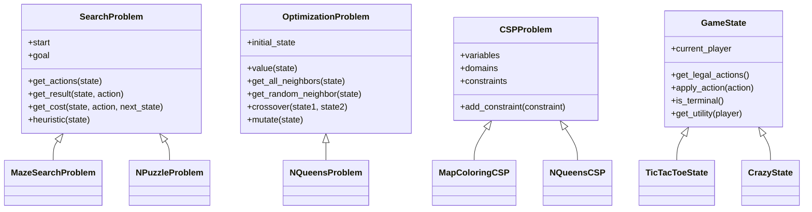

# 🚀 Advanced Agentic AI Framework

A state-of-the-art, highly modular Object-Oriented AI library implemented from scratch in Python. This framework provides unified abstractions, pluggable solver engines, automated benchmarking pipelines, and interactive Pygame visualizers for a vast array of artificial intelligence paradigms.

---

## 🏗 Architecture & Design System

The core design philosophy of this framework revolves around clean **separation of concerns** between **Domains (State Representations)** and **Solvers (Algorithms)**. All problems inherit from generic abstract base classes, allowing any solver to be plugged into any matching domain.



---

## 🌟 Key Features & Supported Algorithms

### 1. Classical & Informed Search
* **Uninformed Search**: Depth-First Search (DFS), Breadth-First Search (BFS), Uniform-Cost Search (UCS/Dijkstra), Iterative Deepening DFS (IDDFS), and Bidirectional Search.
* **Informed (Heuristic) Search**: A* Search, Bidirectional A* (using the correct $\mu$-bound stopping condition), Greedy Best-First Search (GBFS), Iterative-Deepening A* (IDA*), Iterative-Deepening GBFS (IGBFS), Recursive Best-First Search (RBFS), and Simplified Memory-Bounded A* (SMA*).
* **Heuristics & Databases**: Pattern Databases (PDB) generator and loader for optimal heuristic estimations.

### 2. Local & Continuous Optimization
* Steepest-Ascent Hill Climbing, Simulated Annealing (with exponential cooling schedules), Local Beam Search (maintaining $k$ parallel beams), and Genetic Algorithms (featuring crossover, mutation, and roulette-wheel selection).

### 3. Constraint Satisfaction Problems (CSP)
* Pluggable Backtracking Solver featuring:
  * **Variable Ordering**: Minimum Remaining Values (MRV) & Degree Heuristics.
  * **Value Ordering**: Least Constraining Value (LCV).
  * **Inference Engines**: Forward Checking, Arc Consistency (AC-3), and Maintaining Arc Consistency (MAC).
* Min-Conflicts local search solver for dense CSPs.

### 4. Adversarial Search (Games)
* Pure Minimax, Alpha-Beta Pruning, Alpha-Beta with Move Ordering (Killer Moves & History Heuristic), Iterative Deepening (Time-Bounded Search), and Expectiminimax for stochastic games.
* Monte Carlo Tree Search (MCTS) utilizing Upper Confidence bound for Trees (UCT) selection, expansion, random simulation playouts, and backpropagation.
* Pluggable Tournament Engine to pit different agents (MCTS, Alpha-Beta, Random) against each other.

---

## 📊 Constraint Satisfaction Benchmarks

The effectiveness of these heuristics and inference engines is demonstrated in the table below:

| Problem      | BT (Naive)           | BT + MRV             | BT + FC              | BT + MAC (AC-3)      | Min-Conflicts        |
|--------------|----------------------|----------------------|----------------------|----------------------|----------------------|
| Map Coloring | 11 nodes (0.0003s)   | 11 nodes (0.0002s)   | 7 nodes (0.0002s)    | 7 nodes (0.0003s)    | 10 steps (0.0002s)   |
| 8-Queens     | 876 nodes (0.0061s)  | 876 nodes (0.0062s)  | 88 nodes (0.0036s)   | 20 nodes (0.0042s)   | 42 steps (0.0024s)   |
| Sudoku Easy  | HANGS FOREVER        | 1637 nodes (0.1298s) | 489 nodes (0.2555s)  | 402 nodes (0.3400s)  | N/A (Too dense)      |
| Sudoku Hard  | HANGS FOREVER        | HANGS FOREVER        | 5587 nodes (2.7933s) | 1768 nodes (2.3466s) | N/A (Too dense)      |

---

## 🚀 Quick Start & Run Instructions

### Setup Environment
Make sure you have Python 3.10+ and pygame installed:
```bash
pip install -r requirements.txt
```

### Running the Visualizers & Demos
Interactive visualizers are available to watch search paths and games dynamically.

1. **Crazy Card Game (Visualizer & Playable Demo)**:
   * Play against a strategic AI with wildcard suit changes, penalty card counters, and automatic turn transitions.
   ```bash
   python demo/crazy_demo.py
   ```
2. **N-Puzzle (8-Puzzle / 15-Puzzle Solver Visualizer)**:
   ```bash
   python visualization/PuzzleVisualizer.py
   ```
3. **Maze Domain Solver Visualizer**:
   ```bash
   python visualization/MazeVisualizer.py
   ```

### Running Unit Tests
We maintain 75+ unit tests checking every search algorithm, optimization routine, CSP heuristic, and the complete Crazy card game ruleset:
```bash
python -m pytest -v
```
