# 🚀 Advanced Agentic AI Framework

A state-of-the-art, highly modular Object-Oriented AI library implemented from scratch in Python. This framework provides unified abstractions, pluggable solver engines, automated benchmarking pipelines, and interactive Pygame visualizers for a vast array of artificial intelligence paradigms.

---

## 🏗 Architecture & Design System

The core design philosophy of this framework revolves around clean **separation of concerns** between **Domains (State Representations)** and **Solvers (Algorithms)**. All problems inherit from generic abstract base classes, allowing any solver to be plugged into any matching domain.

```mermaid
classDiagram
    class SearchProblem {
        +start
        +goal
        +get_actions(state)
        +get_result(state, action)
        +get_cost(state, action, next_state)
        +heuristic(state)
    }

    class OptimizationProblem {
        +initial_state
        +value(state)
        +get_all_neighbors(state)
        +get_random_neighbor(state)
        +crossover(state1, state2)
        +mutate(state)
    }

    class CSPProblem {
        +variables
        +domains
        +constraints
        +add_constraint(constraint)
    }

    class GameState {
        +current_player
        +get_legal_actions()
        +apply_action(action)
        +is_terminal()
        +get_utility(player)
    }

    class MazeSearchProblem
    class NPuzzleProblem
    class RomanianMapProblem
    class WordLadderProblem
    class SokobanProblem
    class VacuumWorldProblem

    class NQueensProblem
    class TSPProblem

    class MapColoringCSP
    class NQueensCSP
    class SudokuCSP
    class CryptarithmeticCSP
    class TimetablingCSP

    class TicTacToeState
    class ConnectFourState
    class CheckersState
    class OthelloState
    class CrazyState

    SearchProblem <|-- MazeSearchProblem
    SearchProblem <|-- NPuzzleProblem
    SearchProblem <|-- RomanianMapProblem
    SearchProblem <|-- WordLadderProblem
    SearchProblem <|-- SokobanProblem
    SearchProblem <|-- VacuumWorldProblem

    OptimizationProblem <|-- NQueensProblem
    OptimizationProblem <|-- TSPProblem

    CSPProblem <|-- MapColoringCSP
    CSPProblem <|-- NQueensCSP
    CSPProblem <|-- SudokuCSP
    CSPProblem <|-- CryptarithmeticCSP
    CSPProblem <|-- TimetablingCSP

    GameState <|-- TicTacToeState
    GameState <|-- ConnectFourState
    GameState <|-- CheckersState
    GameState <|-- OthelloState
    GameState <|-- CrazyState
```



---

## 🔌 Pluggable Architecture & Modularity

This framework is built to be completely pluggable. Swap algorithms, heuristics, or domains by modifying a single line of code in your demos or benchmarking scripts.

### 1. Swapping Classical Search Algorithms
Swapping search algorithms requires zero changes to the domain itself. Just pass the problem instance to a different solver class:
```python
from domains.maze.MazeSearch import MazeSearchProblem
from search.informed.AStar import AStar
from search.uninformed.BFS import BFS

# Instantiate the problem
problem = MazeSearchProblem(maze, start=(0,0), goal=(9,9))

# Swap solvers instantly:
solver = AStar(problem)  # Optimal informed search
# solver = BFS(problem)    # Uninformed breadth-first search

result = solver.run()
```

### 2. Customizing CSP Inference & Ordering
Swap variable selection heuristics or arc consistency algorithms seamlessly on the backtracking solver:
```python
from domains.sudoku.Sudoku import SudokuCSP
from csp.Backtracking import BacktrackingSolver
from csp.heuristics.MRV import mrv
from csp.inference.MAC import mac
from csp.inference.ForwardChecking import forward_checking

problem = SudokuCSP(board)

# Configure backtracking solver with your choice of heuristics and inference:
solver = BacktrackingSolver(
    problem,
    select_unassigned_variable=mrv,    # Swap with degree heuristic or default
    inference=mac                       # Swap with forward_checking or default
)
solution = solver.solve()
```

### 3. Swapping Adversarial Game Agents
Run a tournament pitting different adversarial algorithms directly against each other:
```python
from domains.tic_tac_toe.TicTacToe import TicTacToeState
from games.Minimax import MinimaxSolver
from games.MCTS import MCTSSolver

state = TicTacToeState()

# Instantiate different pluggable agents:
agent_minimax = MinimaxSolver()
agent_mcts = MCTSSolver(num_simulations=1000)

# Each exposes the same unified interface:
action = agent_minimax.get_best_action(state)
```

---

## 🌟 Key Features & Supported Algorithms

### 1. Classical & Informed Search
* **Uninformed Search**: Depth-First Search (DFS), Breadth-First Search (BFS), Uniform-Cost Search (UCS/Dijkstra), Iterative Deepening DFS (IDDFS), and Bidirectional Search.
* **Informed (Heuristic) Search**: A* Search, Bidirectional A* (using the correct $\mu$-bound stopping condition), Greedy Best-First Search (GBFS), Iterative-Deepening A* (IDA*), Iterative-Deepening GBFS (IGBFS), Recursive Best-First Search (RBFS), and Simplified Memory-Bounded A* (SMA*).
* **Heuristics & Databases**: Pattern Databases (PDB) generator and loader for optimal heuristic estimations.

### 2. Local & Continuous Optimization
* Steepest-Ascent Hill Climbing, Simulated Annealing (with exponential cooling schedules), Local Beam Search (maintaining $k$ parallel beams), and Genetic Algorithms (featuring crossover, mutation, and roulette-wheel selection).

### 3. Constraint Satisfaction Problems (CSP)
* Pluggable Backtracking Solver featuring:
  * **Variable Ordering**: Minimum Remaining Values (MRV) & Degree Heuristics.
  * **Value Ordering**: Least Constraining Value (LCV).
  * **Inference Engines**: Forward Checking, Arc Consistency (AC-3), and Maintaining Arc Consistency (MAC).
* Min-Conflicts local search solver for dense CSPs.

### 4. Adversarial Search (Games)
* Pure Minimax, Alpha-Beta Pruning, Alpha-Beta with Move Ordering (Killer Moves & History Heuristic), Iterative Deepening (Time-Bounded Search), and Expectiminimax for stochastic games.
* Monte Carlo Tree Search (MCTS) utilizing Upper Confidence bound for Trees (UCT) selection, expansion, random simulation playouts, and backpropagation.
* Pluggable Tournament Engine to pit different agents (MCTS, Alpha-Beta, Random) against each other.

---

## 📊 Constraint Satisfaction Benchmarks

The effectiveness of these heuristics and inference engines is demonstrated in the table below:

| Problem      | BT (Naive)           | BT + MRV             | BT + FC              | BT + MAC (AC-3)      | Min-Conflicts        |
|--------------|----------------------|----------------------|----------------------|----------------------|----------------------|
| Map Coloring | 11 nodes (0.0003s)   | 11 nodes (0.0002s)   | 7 nodes (0.0002s)    | 7 nodes (0.0003s)    | 10 steps (0.0002s)   |
| 8-Queens     | 876 nodes (0.0061s)  | 876 nodes (0.0062s)  | 88 nodes (0.0036s)   | 20 nodes (0.0042s)   | 42 steps (0.0024s)   |
| Sudoku Easy  | HANGS FOREVER        | 1637 nodes (0.1298s) | 489 nodes (0.2555s)  | 402 nodes (0.3400s)  | N/A (Too dense)      |
| Sudoku Hard  | HANGS FOREVER        | HANGS FOREVER        | 5587 nodes (2.7933s) | 1768 nodes (2.3466s) | N/A (Too dense)      |

---

## 📊 Classical & Informed Search Benchmarks

The table below summarizes node expansions and execution runtimes for various search algorithms on N-Puzzle and Maze domains (parsed from `results/search_benchmark.csv`):

### 1. N-Puzzle Performance (8-Puzzle & 15-Puzzle)

| Problem Instance | BFS (Nodes / Time) | IDDFS (Nodes / Time) | A* + PDB (Nodes / Time) | IDA* + PDB (Nodes / Time) | Bidir A* (Nodes / Time) |
|------------------|--------------------|----------------------|-------------------------|---------------------------|-------------------------|
| **8-Puzzle Med** | 664 / 0.009s       | 127 / 0.001s         | 11 / 0.0003s            | 10 / 0.0002s              | 36 / 0.0011s            |
| **8-Puzzle Hard**| 3,505 / 0.032s     | 19,955 / 0.166s      | 16 / 0.0006s            | 15 / 0.0005s              | 104 / 0.0077s           |
| **15-Puzzle Hard**| N/A (Memory Limit)| N/A (Time Limit)      | 23 / 0.0021s            | 26 / 0.0017s              | 2,022 / 0.1775s         |

### 2. Maze Solving Performance (Grid Pathfinding)

| Maze Size   | BFS (Nodes / Time) | UCS/Dijkstra (Nodes / Time) | A* (Nodes / Time) | IDA* (Nodes / Time) | Bidir A* (Nodes / Time) |
|-------------|--------------------|-----------------------------|-------------------|---------------------|-------------------------|
| **10×10**   | 95 / 0.0008s       | 49 / 0.0005s                | 32 / 0.0005s      | 31 / 0.0004s        | 50 / 0.0007s            |
| **30×30**   | 881 / 0.0076s      | 395 / 0.0059s               | 617 / 0.0102s     | 4,541 / 0.0529s     | 305 / 0.0049s           |
| **50×50**   | 2,473 / 0.0389s    | 1,343 / 0.0385s             | 2,390 / 0.1066s    | 56,073 / 1.2256s    | 1,049 / 0.0339s         |

### Key Takeaways:
* **The Power of Pattern Databases (PDB)**: Using a precomputed Pattern Database heuristic in the 8-puzzle and 15-puzzle reduces node expansions by up to **99.9%** (e.g. A* solves the hard 8-puzzle in just 16 node expansions, compared to 3,505 for BFS).
* **Memory-Optimized IDA***: IDA* maintains $O(bd)$ space complexity while performing almost identically to A* in terms of path cost and node expansions.
* **Bidirectional A* Savings**: In grid pathfinding (Mazes), Bidirectional A* consistently outperforms standard A* on larger dimensions (e.g., in a 50×50 maze, Bidirectional A* is **3x faster** and expands only **1,049 nodes** compared to A*'s **2,390 nodes**).

---

## 🚀 Quick Start & Run Instructions

### Setup Environment
Make sure you have Python 3.10+ and pygame installed:
```bash
pip install -r requirements.txt
```

### Running the Visualizers & Demos
Interactive visualizers are available to watch search paths and games dynamically.

1. **Crazy Card Game (Visualizer & Playable Demo)**:
   * Play against a strategic AI with wildcard suit changes, penalty card counters, and automatic turn transitions.
   ```bash
   python demo/crazy_demo.py
   ```
2. **N-Puzzle (8-Puzzle / 15-Puzzle Solver Visualizer)**:
   ```bash
   python visualization/PuzzleVisualizer.py
   ```
3. **Maze Domain Solver Visualizer**:
   ```bash
   python visualization/MazeVisualizer.py
   ```

### Running Unit Tests
We maintain 75+ unit tests checking every search algorithm, optimization routine, CSP heuristic, and the complete Crazy card game ruleset:
```bash
python -m pytest -v
```
