# AI Lab — Automated Benchmark Report

This report is automatically generated from raw benchmark CSV files in `results/`.

To regenerate: `python -m utils.generate_markdown_tables`

For performance charts: `python -m benchmarks.generate_report`

---

## 1. N-Puzzle Search Performance

### 1a. 8-Puzzle

| Algorithm / Instance | Success Rate | Avg Path Cost | Avg Nodes Expanded | Avg Runtime (s) | Runs |
| --- | --- | --- | --- | --- | --- |
| DFS / 8pzl easy | 30/30 | 23907.2 | 81,199 | 0.661679 | 30 |
| BFS / 8pzl easy | 30/30 | 3.1 | 27 | 0.004035 | 30 |
| UCS / 8pzl easy | 30/30 | 3.1 | 27 | 0.003835 | 30 |
| IDDFS / 8pzl easy | 30/30 | 7.1 | 11,144 | 0.087979 | 30 |
| Bidir-Search / 8pzl easy | 30/30 | 3.1 | 8 | 0.003845 | 30 |
| GBFS / 8pzl easy | 30/30 | 8.4 | 22 | 0.005257 | 30 |
| A* / 8pzl easy | 30/30 | 3.1 | 4 | 0.004476 | 30 |
| IDA* / 8pzl easy | 30/30 | 3.1 | 4 | 0.004369 | 30 |
| RBFS / 8pzl easy | 30/30 | 3.1 | 4 | 0.003714 | 30 |
| SMA*(1000) / 8pzl easy | 30/30 | 3.1 | 5 | 0.005401 | 30 |
| Bidir-A* / 8pzl easy | 30/30 | 3.3 | 5 | 0.004871 | 30 |
| IGBFS / 8pzl easy | 30/30 | 301.9 | 6,246 | 0.068389 | 30 |
| DFS / 8pzl medium | 30/30 | 35764.5 | 117,056 | 1.065443 | 30 |
| BFS / 8pzl medium | 30/30 | 6.0 | 395 | 0.010771 | 30 |
| UCS / 8pzl medium | 30/30 | 6.0 | 395 | 0.010995 | 30 |
| IDDFS / 8pzl medium | 30/30 | 13.1 | 12,335 | 0.160526 | 30 |
| Bidir-Search / 8pzl medium | 30/30 | 6.0 | 38 | 0.005812 | 30 |
| GBFS / 8pzl medium | 30/30 | 6.0 | 7 | 0.005862 | 30 |
| A* / 8pzl medium | 30/30 | 6.0 | 7 | 0.005296 | 30 |
| IDA* / 8pzl medium | 30/30 | 6.0 | 6 | 0.005059 | 30 |
| RBFS / 8pzl medium | 30/30 | 6.0 | 6 | 0.005178 | 30 |
| SMA*(1000) / 8pzl medium | 30/30 | 6.0 | 8 | 0.004857 | 30 |
| Bidir-A* / 8pzl medium | 30/30 | 6.0 | 17 | 0.005941 | 30 |
| IGBFS / 8pzl medium | 30/30 | 151.5 | 286 | 0.016137 | 30 |
| GBFS / 8pzl hard | 30/30 | 9.6 | 12 | 0.006944 | 30 |
| A* / 8pzl hard | 30/30 | 9.0 | 10 | 0.006528 | 30 |
| IDA* / 8pzl hard | 30/30 | 9.0 | 11 | 0.006819 | 30 |
| RBFS / 8pzl hard | 30/30 | 9.0 | 26 | 0.006462 | 30 |
| SMA*(1000) / 8pzl hard | 30/30 | 9.0 | 14 | 0.006753 | 30 |
| Bidir-A* / 8pzl hard | 30/30 | 9.0 | 48 | 0.008649 | 30 |
| IGBFS / 8pzl hard | 30/30 | 613.9 | 995 | 0.044847 | 30 |
| A* (misplaced_tile) / 8pzl medium | 30/30 | 5.8 | 12 | 0.005106 | 30 |
| IDA* (misplaced_tile) / 8pzl medium | 30/30 | 5.8 | 19 | 0.004389 | 30 |
| A* (manhattan) / 8pzl medium | 30/30 | 6.3 | 12 | 0.004193 | 30 |
| IDA* (manhattan) / 8pzl medium | 30/30 | 6.3 | 23 | 0.003762 | 30 |
| A* (pattern_db) / 8pzl medium | 30/30 | 5.2 | 6 | 0.003647 | 30 |
| IDA* (pattern_db) / 8pzl medium | 30/30 | 5.2 | 5 | 0.003616 | 30 |

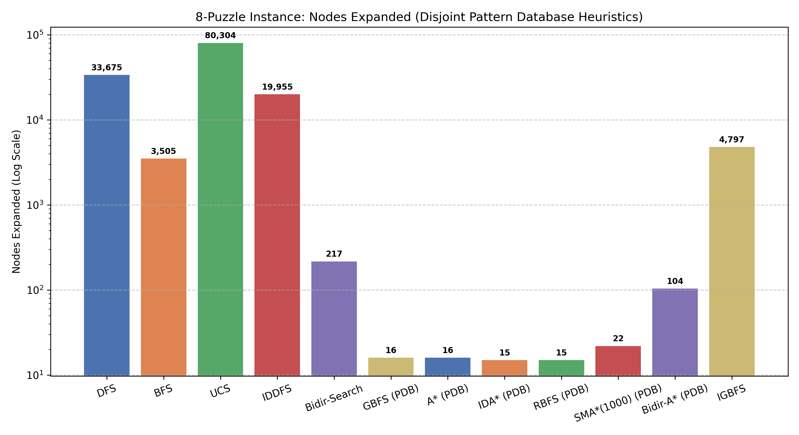

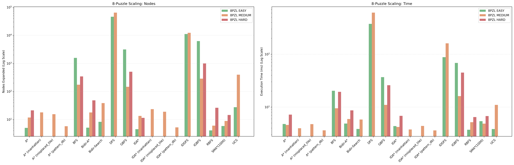

### 1b. 15-Puzzle

| Algorithm / Instance | Success Rate | Avg Path Cost | Avg Nodes Expanded | Avg Runtime (s) | Runs |
| --- | --- | --- | --- | --- | --- |
| GBFS / 15pzl medium | 30/30 | 9.1 | 10 | 0.005073 | 30 |
| A* / 15pzl medium | 30/30 | 8.9 | 10 | 0.006081 | 30 |
| IDA* / 15pzl medium | 30/30 | 8.9 | 10 | 0.006807 | 30 |
| RBFS / 15pzl medium | 30/30 | 8.9 | 17 | 0.006770 | 30 |
| SMA*(1000) / 15pzl medium | 30/30 | 8.9 | 16 | 0.006974 | 30 |
| Bidir-A* / 15pzl medium | 30/30 | 8.9 | 117 | 0.017935 | 30 |
| IGBFS / 15pzl medium | 28/30 | 9831.5 | 18,336 | 0.993270 | 30 |
| GBFS / 15pzl hard | 30/30 | 23.4 | 50 | 0.004233 | 30 |
| A* / 15pzl hard | 30/30 | 15.0 | 26 | 0.004366 | 30 |
| IDA* / 15pzl hard | 30/30 | 15.0 | 36 | 0.003877 | 30 |
| RBFS / 15pzl hard | 30/30 | 15.0 | 570 | 0.009372 | 30 |
| SMA*(1000) / 15pzl hard | 30/30 | 15.0 | 49 | 0.004753 | 30 |
| Bidir-A* / 15pzl hard | 30/30 | 15.0 | 1,971 | 0.100859 | 30 |
| IGBFS / 15pzl hard | 26/30 | 44127.2 | 76,436 | 3.075609 | 30 |

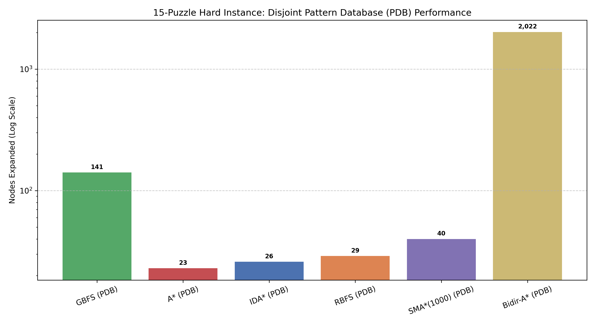

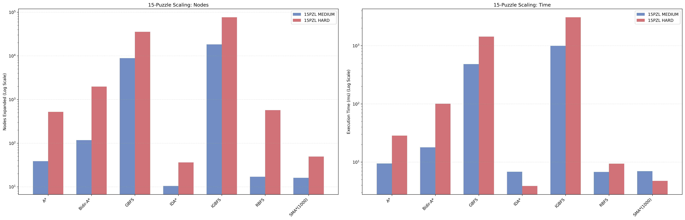

---

## 2. Maze Pathfinding

| Algorithm / Instance | Success Rate | Avg Path Cost | Avg Nodes Expanded | Avg Runtime (s) | Runs |
| --- | --- | --- | --- | --- | --- |
| DFS / maze 10x10 | 30/30 | 22.9 | 78 | 0.002187 | 30 |
| BFS / maze 10x10 | 30/30 | 22.9 | 82 | 0.002276 | 30 |
| UCS / maze 10x10 | 30/30 | 22.9 | 82 | 0.002343 | 30 |
| IDDFS / maze 10x10 | 30/30 | 22.9 | 83 | 0.002329 | 30 |
| Bidir-Search / maze 10x10 | 30/30 | 22.9 | 58 | 0.002249 | 30 |
| GBFS / maze 10x10 | 30/30 | 22.9 | 40 | 0.002528 | 30 |
| A* / maze 10x10 | 30/30 | 22.9 | 46 | 0.002925 | 30 |
| IDA* / maze 10x10 | 30/30 | 22.9 | 116 | 0.002820 | 30 |
| RBFS / maze 10x10 | 28/30 | 22.1 | 14,917 | 0.171006 | 30 |
| SMA*(1000) / maze 10x10 | 30/30 | 22.9 | 50 | 0.006847 | 30 |
| Bidir-A* / maze 10x10 | 30/30 | 22.9 | 54 | 0.003577 | 30 |
| IGBFS / maze 10x10 | 30/30 | 22.9 | 43 | 0.002998 | 30 |
| DFS / maze 30x30 | 30/30 | 95.4 | 622 | 0.005584 | 30 |
| BFS / maze 30x30 | 30/30 | 95.4 | 810 | 0.006976 | 30 |
| UCS / maze 30x30 | 30/30 | 95.4 | 810 | 0.007124 | 30 |
| IDDFS / maze 30x30 | 30/30 | 95.4 | 793 | 0.006616 | 30 |
| Bidir-Search / maze 30x30 | 30/30 | 95.4 | 533 | 0.007157 | 30 |
| GBFS / maze 30x30 | 30/30 | 95.4 | 324 | 0.004994 | 30 |
| A* / maze 30x30 | 30/30 | 95.4 | 554 | 0.007931 | 30 |
| IDA* / maze 30x30 | 30/30 | 95.4 | 5,789 | 0.039199 | 30 |
| RBFS / maze 30x30 | 0/30 | — | — | — | 30 |
| SMA*(1000) / maze 30x30 | 30/30 | 95.4 | 570 | 0.072885 | 30 |
| Bidir-A* / maze 30x30 | 30/30 | 95.4 | 536 | 0.009445 | 30 |
| IGBFS / maze 30x30 | 30/30 | 95.4 | 372 | 0.005712 | 30 |
| DFS / maze 50x50 | 30/30 | 168.7 | 1,822 | 0.010232 | 30 |
| BFS / maze 50x50 | 30/30 | 168.7 | 2,225 | 0.012640 | 30 |
| UCS / maze 50x50 | 30/30 | 168.7 | 2,225 | 0.013000 | 30 |
| IDDFS / maze 50x50 | 30/30 | 168.7 | 2,111 | 0.011362 | 30 |
| Bidir-Search / maze 50x50 | 30/30 | 168.7 | 1,351 | 0.008104 | 30 |
| GBFS / maze 50x50 | 30/30 | 168.7 | 669 | 0.006027 | 30 |
| A* / maze 50x50 | 30/30 | 168.7 | 1,599 | 0.015553 | 30 |
| IDA* / maze 50x50 | 30/30 | 168.7 | 27,725 | 0.155407 | 30 |
| RBFS / maze 50x50 | 0/30 | — | — | — | 30 |
| SMA*(1000) / maze 50x50 | 30/30 | 168.7 | 1,624 | 0.116029 | 30 |
| Bidir-A* / maze 50x50 | 30/30 | 168.7 | 1,298 | 0.013352 | 30 |
| IGBFS / maze 50x50 | 30/30 | 168.7 | 844 | 0.008676 | 30 |
| A* (manhattan) / maze 30x30 | 30/30 | 91.3 | 518 | 0.008934 | 30 |
| A* (euclidean) / maze 30x30 | 30/30 | 98.6 | 328 | 0.006708 | 30 |

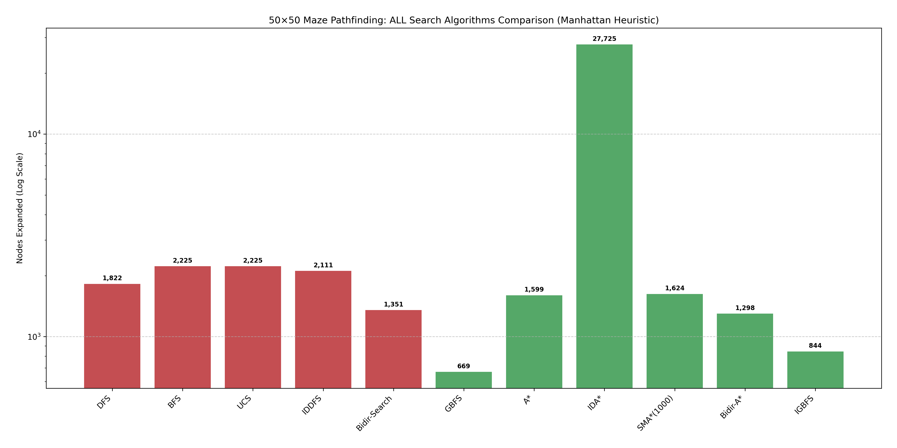

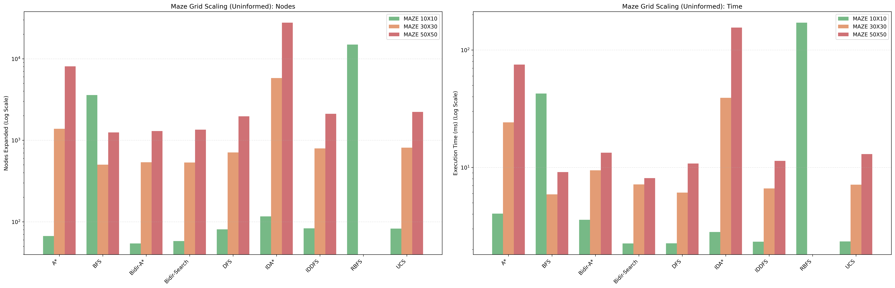

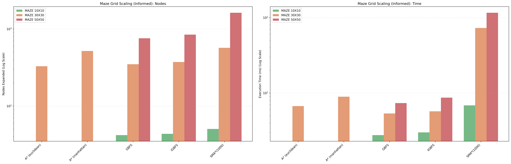

---

## 3. Local Search & Optimization

### 3a. TSP (20 Cities)

| Algorithm / Instance | Success Rate | Avg Path Cost | Avg Nodes Expanded | Avg Runtime (s) | Runs |
| --- | --- | --- | --- | --- | --- |
| Hill Climbing / TSP (20 Cities) | 30/30 | -3.2 | 19 | 0.023177 | 30 |
| Simulated Annealing / TSP (20 Cities) | 30/30 | -3.2 | 856 | 0.058550 | 30 |
| Local Beam (k=5) / TSP (20 Cities) | 30/30 | -3.2 | 75 | 0.088169 | 30 |
| Genetic Algorithm / TSP (20 Cities) | 30/30 | -3.2 | 14,400 | 0.380175 | 30 |

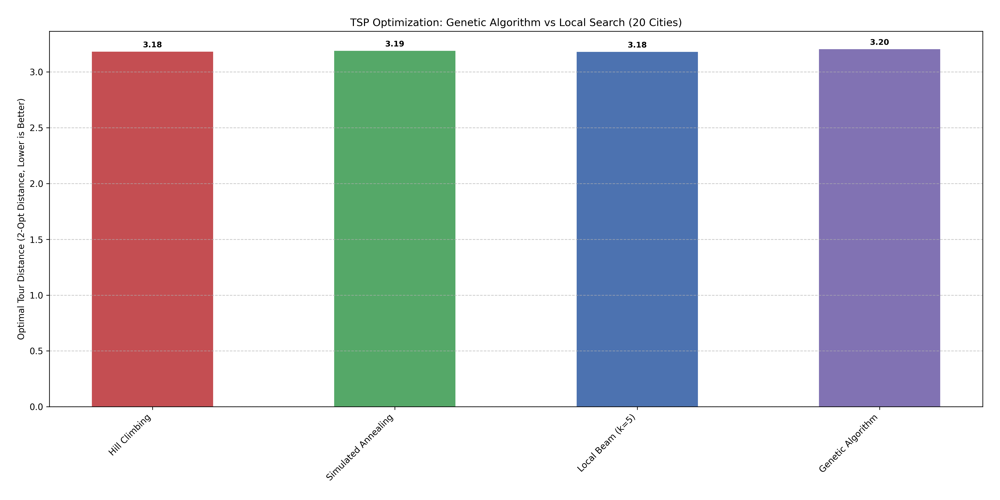

### 3b. N-Queens Local Search

| Algorithm / Instance | Success Rate | Avg Path Cost | Avg Nodes Expanded | Avg Runtime (s) | Runs |
| --- | --- | --- | --- | --- | --- |
| Hill Climbing / 8-Queens | 30/30 | 26.9 | 4 | 0.005699 | 30 |
| Simulated Annealing / 8-Queens | 30/30 | 27.8 | 235 | 0.028190 | 30 |
| Local Beam (k=5) / 8-Queens | 30/30 | 27.3 | 18 | 0.015540 | 30 |
| Genetic Algorithm / 8-Queens | 30/30 | 27.5 | 14,400 | 0.375634 | 30 |

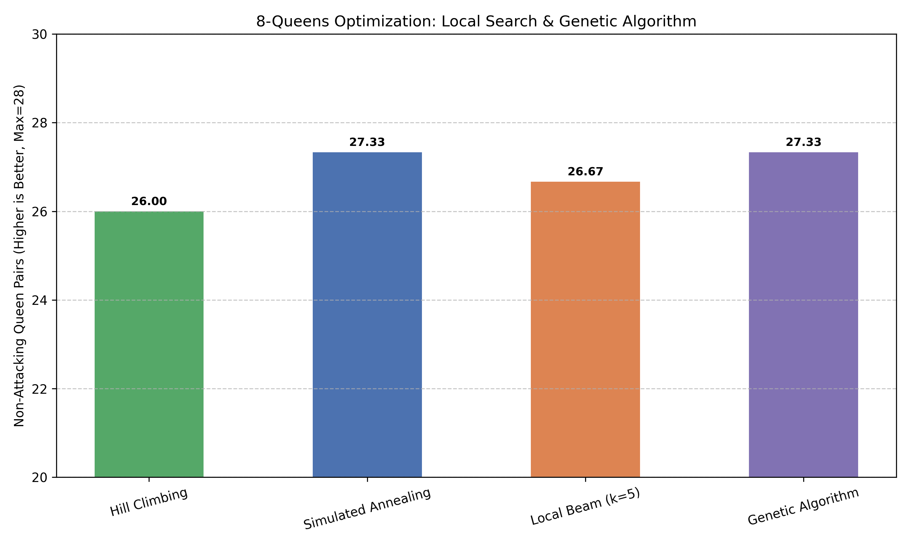

---

## 4. Constraint Satisfaction Problems (CSP)

| Solver / Problem | Success Rate | Avg Nodes | Avg Runtime (s) | Runs |
| --- | --- | --- | --- | --- |
| BT (Naive) / 8-Queens | 45/45 | 876 | 0.008208 | 45 |
| BT (Naive) / Map Coloring | 45/45 | 11 | 0.000852 | 45 |
| BT+Degree / 8-Queens | 45/45 | 876 | 0.008563 | 45 |
| BT+Degree / Map Coloring | 45/45 | 15 | 0.000753 | 45 |
| BT+Degree / Sudoku Easy | 0/3 | — | — | 3 |
| BT+FC / 8-Queens | 45/45 | 88 | 0.005422 | 45 |
| BT+FC / Map Coloring | 45/45 | 7 | 0.000632 | 45 |
| BT+FC / Sudoku Easy | 45/45 | 489 | 0.353034 | 45 |
| BT+FC / Sudoku Hard | 0/1 | — | — | 1 |
| BT+LCV / 8-Queens | 45/45 | 991 | 0.022066 | 45 |
| BT+LCV / Map Coloring | 45/45 | 11 | 0.000825 | 45 |
| BT+LCV / Sudoku Easy | 0/1 | — | — | 1 |
| BT+MAC / 8-Queens | 45/45 | 20 | 0.005427 | 45 |
| BT+MAC / Map Coloring | 45/45 | 7 | 0.000740 | 45 |
| BT+MAC / Sudoku Easy | 45/45 | 402 | 0.546820 | 45 |
| BT+MAC / Sudoku Hard | 0/1 | — | — | 1 |
| BT+MRV / 8-Queens | 45/45 | 876 | 0.008017 | 45 |
| BT+MRV / Map Coloring | 45/45 | 11 | 0.000563 | 45 |
| BT+MRV / Sudoku Easy | 45/45 | 1,637 | 0.213330 | 45 |
| BT+MRV+FC / 8-Queens | 45/45 | 75 | 0.004270 | 45 |
| BT+MRV+FC / Map Coloring | 45/45 | 7 | 0.000642 | 45 |
| BT+MRV+FC / Sudoku Easy | 45/45 | 81 | 0.099541 | 45 |
| BT+MRV+FC / Sudoku Hard | 10/10 | 5,587 | 1.722920 | 10 |
| BT+MRV+MAC / 8-Queens | 45/45 | 20 | 0.005533 | 45 |
| BT+MRV+MAC / Map Coloring | 45/45 | 7 | 0.000821 | 45 |
| BT+MRV+MAC / Sudoku Easy | 45/45 | 81 | 0.184291 | 45 |
| BT+MRV+MAC / Sudoku Hard | 10/10 | 1,768 | 1.454626 | 10 |
| Backjumping / 8-Queens | 45/45 | 844 | 0.006965 | 45 |
| Backjumping / Map Coloring | 45/45 | 11 | 0.000692 | 45 |
| Backjumping / Sudoku Easy | 0/1 | — | — | 1 |
| CBJ / 8-Queens | 45/45 | 862 | 0.007382 | 45 |
| CBJ / Map Coloring | 45/45 | 11 | 0.000643 | 45 |
| CBJ / Sudoku Easy | 0/1 | — | — | 1 |
| Min-Conflicts / 8-Queens | 42/45 | 62 | 0.004440 | 45 |
| Min-Conflicts / Map Coloring | 45/45 | 11 | 0.000815 | 45 |
| Symmetric BT / 8-Queens | 45/45 | 876 | 0.006367 | 45 |
| Symmetric BT / Map Coloring | 45/45 | 11 | 0.000693 | 45 |
| Symmetric BT / Sudoku Easy | 0/1 | — | — | 1 |

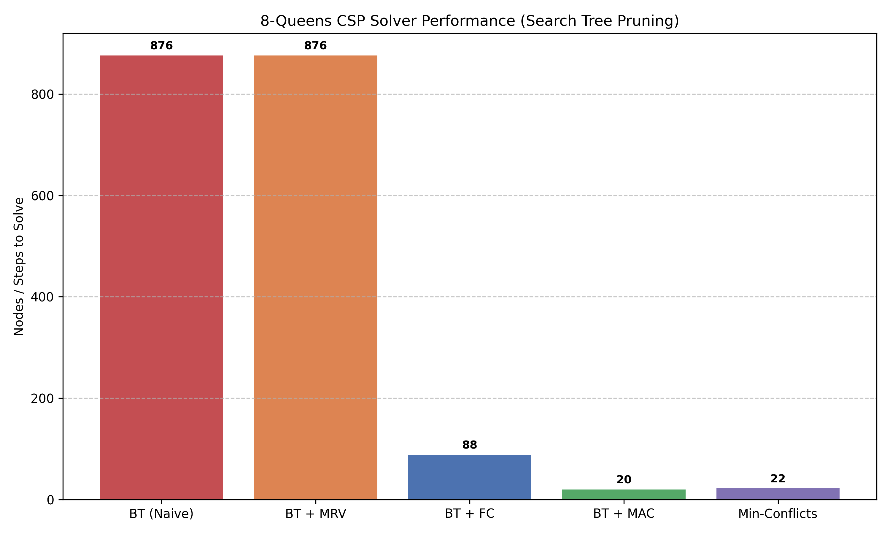

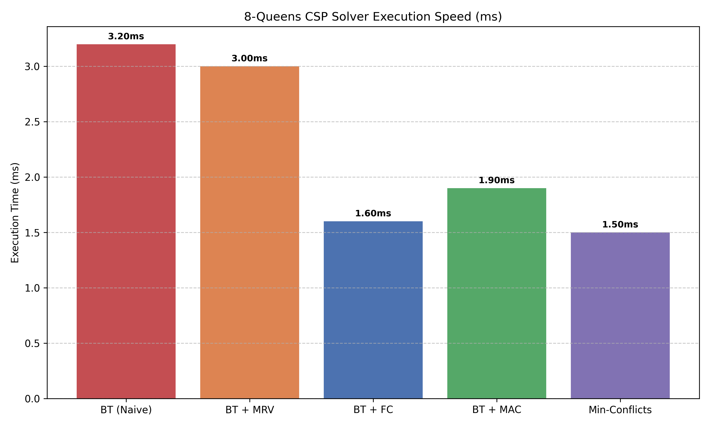

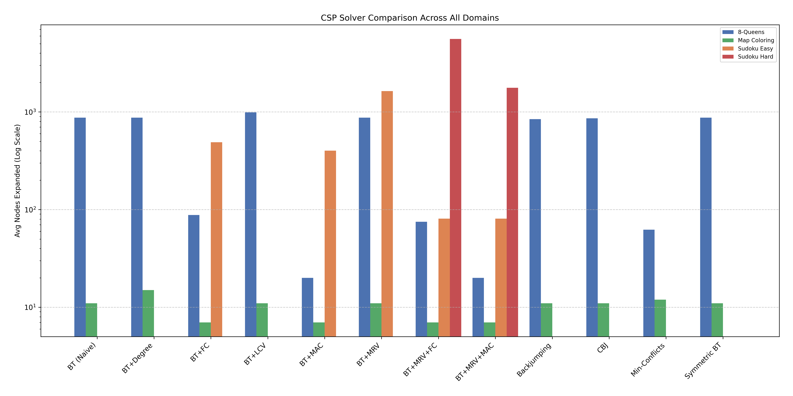

---

## 5. Adversarial Game Tournament

| Game | Agent 1 | Agent 2 | Agent 1 Wins | Agent 2 Wins | Draws | Avg Time (s) |
| --- | --- | --- | --- | --- | --- | --- |
| Tic-Tac-Toe | Minimax | AlphaBeta | 0 | 0 | 5 | 3.982086 |
| Tic-Tac-Toe | Minimax | AlphaBetaOrdered | 5 | 0 | 0 | 3.943572 |
| Tic-Tac-Toe | Minimax | MCTS(n=30) | 5 | 0 | 0 | 4.270522 |
| Tic-Tac-Toe | Minimax | IterativeDeepening | 0 | 0 | 5 | 3.940993 |
| Tic-Tac-Toe | Minimax | Random | 5 | 0 | 0 | 4.322804 |
| Tic-Tac-Toe | AlphaBeta | AlphaBetaOrdered | 5 | 0 | 0 | 1.194358 |
| Tic-Tac-Toe | AlphaBeta | MCTS(n=30) | 5 | 0 | 0 | 1.282321 |
| Tic-Tac-Toe | AlphaBeta | IterativeDeepening | 0 | 0 | 5 | 1.593 |
| Tic-Tac-Toe | AlphaBeta | Random | 5 | 0 | 0 | 1.42725 |
| Tic-Tac-Toe | AlphaBetaOrdered | MCTS(n=30) | 4 | 0 | 1 | 1.154805 |
| Tic-Tac-Toe | AlphaBetaOrdered | IterativeDeepening | 0 | 0 | 5 | 1.284656 |
| Tic-Tac-Toe | AlphaBetaOrdered | Random | 5 | 0 | 0 | 1.120701 |
| Tic-Tac-Toe | MCTS(n=30) | IterativeDeepening | 0 | 2 | 3 | 1.370991 |
| Tic-Tac-Toe | MCTS(n=30) | Random | 5 | 0 | 0 | 1.451291 |
| Tic-Tac-Toe | IterativeDeepening | Random | 5 | 0 | 0 | 1.780036 |
| Connect Four | AlphaBeta(d=4) | MCTS(n=30) | 1 | 4 | 0 | 1.411262 |
| Connect Four | AlphaBeta(d=4) | Random | 5 | 0 | 0 | 1.425689 |
| Connect Four | MCTS(n=30) | Random | 5 | 0 | 0 | 1.333471 |
| Othello (Reversi) | AlphaBeta(d=3) | MCTS(n=30) | 5 | 0 | 0 | 3.782627 |
| Othello (Reversi) | AlphaBeta(d=3) | Random | 5 | 0 | 0 | 1.446805 |
| Othello (Reversi) | MCTS(n=30) | Random | 5 | 0 | 0 | 3.46425 |
| Checkers | AlphaBeta(d=4) | AlphaBeta(d=6) | 0 | 5 | 0 | 6.162457 |
| Checkers | AlphaBeta(d=4) | MCTS(n=100) | 0 | 5 | 0 | 21.721232 |
| Checkers | AlphaBeta(d=4) | Random | 5 | 0 | 0 | 1.778643 |
| Checkers | AlphaBeta(d=6) | MCTS(n=100) | 2 | 3 | 0 | 25.324356 |
| Checkers | AlphaBeta(d=6) | Random | 5 | 0 | 0 | 6.488075 |
| Checkers | MCTS(n=100) | Random | 5 | 0 | 0 | 8.749236 |
| Crazy Card Game | Obssa Heuristic | IS-MCTS(n=30) | 4 | 1 | 0 | 2.501264 |
| Crazy Card Game | Obssa Heuristic | Random | 3 | 2 | 0 | 1.199025 |
| Crazy Card Game | IS-MCTS(n=30) | Random | 4 | 1 | 0 | 2.826416 |

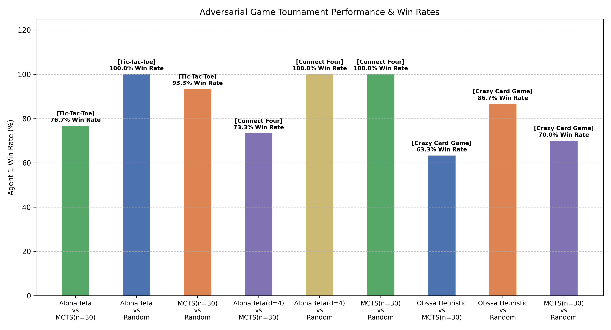

---

## 6. Online Search (LRTA*)

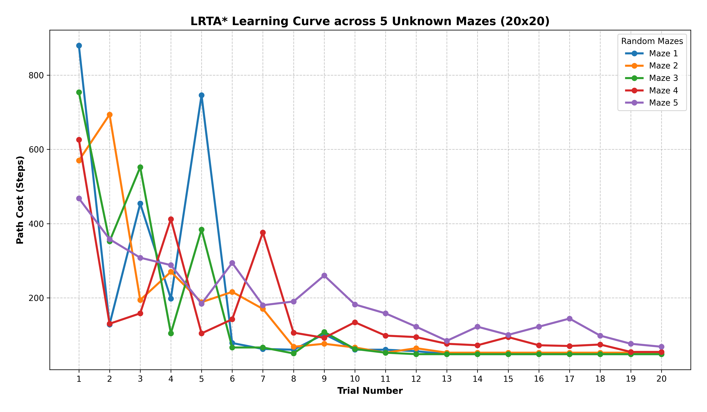

---

## 7. Heuristic Comparison

### A* and IDA* on 8-Puzzle (Misplaced vs Manhattan vs Pattern Database)

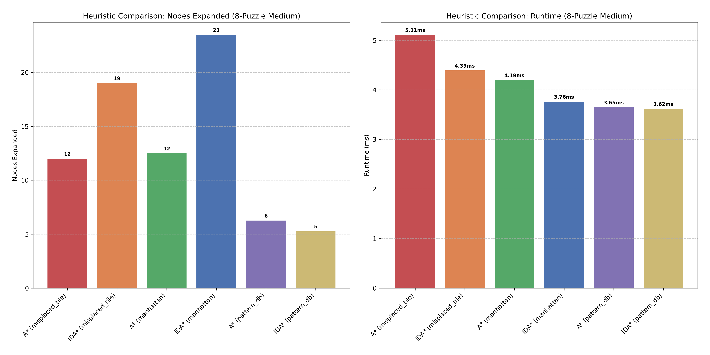
