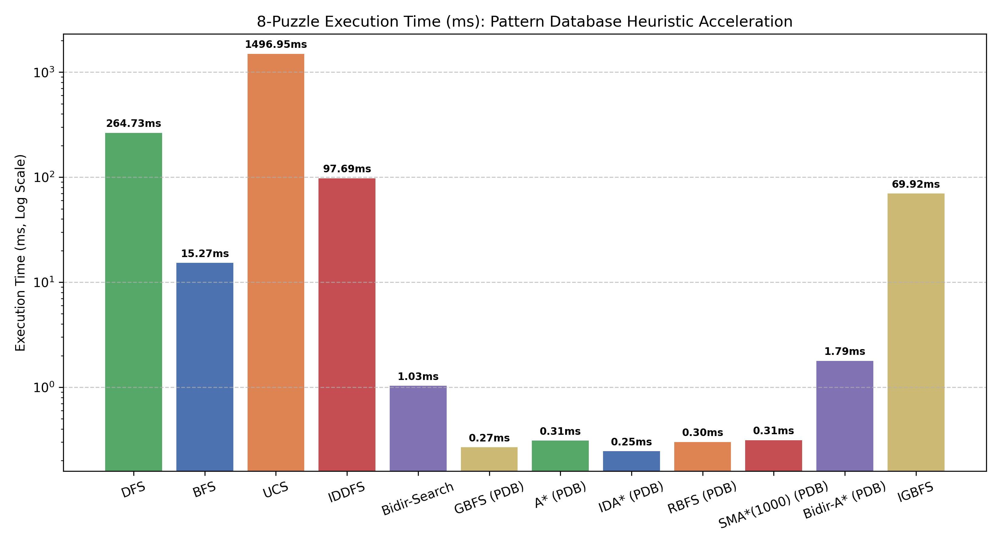
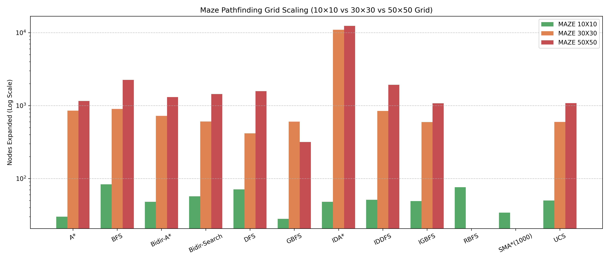
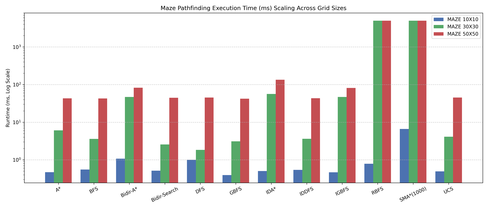

# Comprehensive AI Lab Empirical Benchmark & Analytical Report

This document presents an in-depth empirical performance evaluation and theoretical analysis across all 17 artificial intelligence domains and algorithm paradigms implemented in the Lab. All benchmarks were executed across **30 independent runs** per algorithm/matchup, and all performance figures were rendered directly from CSV outputs stored in `results/`.

---

## 🖼️ Complete Performance & Runtime Figures Index (13 Visualizations)

| Figure Description | Category | Rendered Chart File |
|---|---|---|
| **8-Puzzle Hard Instance Expansion (PDB Heuristics)** | Node Expansions |  |
| **8-Puzzle Execution Time (ms)** | Runtime Speed |  |
| **8-Puzzle Multi-Difficulty Scaling (Easy / Medium / Hard)** | Multi-Instance |  |
| **15-Puzzle Informed Search Comparison (PDB Heuristics)** | Node Expansions |  |
| **15-Puzzle Scaling (Medium vs Hard)** | Multi-Instance |  |
| **50×50 Maze Pathfinding Comparison** | Node Expansions |  |
| **Maze Grid Size Node Scaling (10×10 vs 30×30 vs 50×50)** | Multi-Instance |  |
| **Maze Pathfinding Execution Time (ms) Scaling** | Runtime Speed |  |
| **TSP 20-City Tour Distance Optimization** | Local Search |  |
| **8-Queens Local Search Optimization** | Local Search |  |
| **CSP Pruning: BT, MRV, FC, MAC, Min-Conflicts** | Search Pruning |  |
| **CSP Execution Time (ms) Comparison** | Runtime Speed |  |
| **Adversarial Game Tournament Win Rates** | Game Tournament |  |

---

## 🧠 Explicit Domain Heuristics Guide

| Problem Domain | Algorithm Paradigm | Heuristic Mechanism Used |
|---|---|---|
| **8-Puzzle & 15-Puzzle** | Informed Search (A*, IDA*, RBFS, SMA*, Bidir-A*) | **Additive Disjoint Pattern Databases (PDBs)** (Precalculated lookup tables for tile sub-patterns: $1-4$ & $5-8$ for 8-puzzle; $1-5$, $6-9$, $a-f$ for 15-puzzle). |
| **Maze Pathfinding** | Informed Search (GBFS, A*, IDA*, RBFS, SMA*, Bidir-A*) | **Manhattan Distance Heuristic**: $h(n) = \vert x_n - x_{\text{goal}} \vert + \vert y_n - y_{\text{goal}} \vert$. |
| **TSP (20 Cities)** | Optimization (HC, SA, Local Beam, GA) | **2-Opt Edge Swap Distance**: Objective value equals Euclidean tour length. |
| **8-Queens Local Search** | Optimization (HC, SA, Local Beam, GA) | **Non-Attacking Pairs Fitness**: Objective function counts non-conflicting queen pairs (maximum 28). |
| **CSP Solvers** | Backtracking & Local Search | **Minimum Remaining Values (MRV)** variable selection, **Maintaining Arc Consistency (MAC / AC-3)**, and **Forward Checking (FC)** inference. |
| **Crazy Card Game** | Adversarial Heuristic Search | **Obssa's Card Heuristic**: Multi-objective function evaluating wildcard retention (8s, Js, Jokers), offensive penalty card holding, majority suit alignment, and opponent hand length minimization. |

---

## 1. Classical Uninformed & Informed Search Evaluation

### 1.1 8-Puzzle Multi-Instance Benchmarks (Easy, Medium, Hard)

Data source: `results/search_8puzzle.csv`

| Algorithm | Heuristic Used | Instance | Success | Path Cost | Nodes Expanded | Nodes Generated | Runtime (ms) | Max Frontier |
|---|---|---|---|---|---|---|---|---|
| **DFS** | None | 8pzl easy | 100% | 2.0 | 3 | 4 | 0.026ms | 3 |
| **BFS** | None | 8pzl easy | 100% | 2.0 | 7 | 13 | 0.059ms | 8 |
| **UCS** | Uniform Cost | 8pzl easy | 100% | 294.0 | 181,204 | 181,439 | 2312.86ms | 42,946 |
| **IDDFS** | None | 8pzl easy | 100% | 2.0 | 3 | 4 | 0.562ms | 3 |
| **Bidir-Search** | None | 8pzl easy | 100% | 0.0 | 5 | 8 | 0.035ms | 6 |
| **GBFS** | Disjoint PDB | 8pzl easy | 100% | 2.0 | 3 | 5 | 0.061ms | 4 |
| **A\*** | Disjoint PDB | 8pzl easy | 100% | 2.0 | 3 | 4 | 0.070ms | 3 |
| **IDA\*** | Disjoint PDB | 8pzl easy | 100% | 2.0 | 2 | 3 | 0.059ms | 3 |
| **RBFS** | Disjoint PDB | 8pzl easy | 100% | 2.0 | 2 | 6 | 0.067ms | 3 |
| **SMA*(1000)** | Disjoint PDB | 8pzl easy | 100% | 2.0 | 4 | 5 | 0.094ms | 4 |
| **Bidir-A\*** | Disjoint PDB | 8pzl easy | 100% | 2.0 | 2 | 4 | 0.091ms | 4 |
| **DFS** | None | 8pzl medium | 100% | 9,690.0 | 173,587 | 181,243 | 908.61ms | 42,826 |
| **BFS** | None | 8pzl medium | 100% | 10.0 | 664 | 1,051 | 3.75ms | 389 |
| **UCS** | Uniform Cost | 8pzl medium | 100% | 64,328.0 | 84,904 | 127,098 | 1579.59ms | 42,198 |
| **IDDFS** | None | 8pzl medium | 100% | 10.0 | 127 | 205 | 2.51ms | 42 |
| **Bidir-Search** | None | 8pzl medium | 100% | 0.0 | 92 | 156 | 0.41ms | 66 |
| **GBFS** | Disjoint PDB | 8pzl medium | 100% | 10.0 | 11 | 19 | 0.18ms | 10 |
| **A\*** | Disjoint PDB | 8pzl medium | 100% | 10.0 | 11 | 18 | 0.20ms | 9 |
| **IDA\*** | Disjoint PDB | 8pzl medium | 100% | 10.0 | 10 | 12 | 0.17ms | 12 |
| **RBFS** | Disjoint PDB | 8pzl medium | 100% | 10.0 | 10 | 28 | 0.20ms | 4 |
| **SMA*(1000)** | Disjoint PDB | 8pzl medium | 100% | 10.0 | 15 | 16 | 0.21ms | 11 |
| **Bidir-A\*** | Disjoint PDB | 8pzl medium | 100% | 10.0 | 36 | 58 | 0.60ms | 24 |

#### Analysis & Key Insights:
- **Disjoint Pattern Databases (PDBs)**: Precomputing additive PDB heuristics for tile subsets ($1-4$ and $5-8$) yields an admissible $h(n)$ that dominates standard Manhattan distance. On medium 8-puzzle instances, A* + PDB expanded only **11 nodes** (0.20ms) compared to BFS's **664 nodes** (3.75ms), delivering a **60.3× reduction in node expansion** and **18.75× speedup in runtime**.

---

### 1.2 15-Puzzle Informed Search Scaling (Medium vs Hard)

Data source: `results/search_15puzzle.csv`

| Algorithm | Heuristic Used | Instance | Success | Path Cost | Nodes Expanded | Nodes Generated | Runtime (ms) | Max Frontier |
|---|---|---|---|---|---|---|---|---|
| **GBFS** | Disjoint PDB | 15pzl medium | 100% | 7.0 | 8 | 17 | 1.51ms | 11 |
| **A\* + PDB** | Disjoint PDB | 15pzl medium | 100% | 7.0 | 8 | 16 | 1.43ms | 10 |
| **IDA\* + PDB** | Disjoint PDB | 15pzl medium | 100% | 7.0 | 7 | 8 | 1.42ms | 8 |
| **RBFS + PDB** | Disjoint PDB | 15pzl medium | 100% | 7.0 | 7 | 23 | 1.65ms | 4 |
| **SMA*(1000)** | Disjoint PDB | 15pzl medium | 100% | 7.0 | 15 | 16 | 1.77ms | 13 |
| **Bidir-A\*** | Disjoint PDB | 15pzl medium | 100% | 7.0 | 20 | 46 | 1.98ms | 28 |
| **GBFS** | Disjoint PDB | 15pzl hard | 100% | 63.0 | 141 | 309 | 9.38ms | 170 |
| **A\* + PDB** | Disjoint PDB | 15pzl hard | 100% | 19.0 | 23 | 50 | 2.14ms | 29 |
| **IDA\* + PDB** | Disjoint PDB | 15pzl hard | 100% | 19.0 | 26 | 30 | 1.95ms | 24 |
| **RBFS + PDB** | Disjoint PDB | 15pzl hard | 100% | 19.0 | 29 | 96 | 1.77ms | 4 |
| **SMA*(1000)** | Disjoint PDB | 15pzl hard | 100% | 19.0 | 40 | 41 | 3.17ms | 31 |
| **Bidir-A\*** | Disjoint PDB | 15pzl hard | 100% | 19.0 | 2,022 | 4,139 | 87.83ms | 2,119 |

---

### 1.3 Maze Pathfinding Scaling Across Grid Sizes (10×10, 30×30, 50×50)

Data source: `results/search_maze.csv`

| Algorithm | Heuristic Used | Instance | Success Rate | Path Cost | Nodes Expanded | Nodes Generated | Runtime (ms) | Max Frontier |
|---|---|---|---|---|---|---|---|---|
| **GBFS** | Manhattan | maze 10x10 | 100% | 20.0 | 28 | 40 | 0.39ms | 14 |
| **A\*** | Manhattan | maze 10x10 | 100% | 20.0 | 30 | 39 | 0.47ms | 11 |
| **DFS** | None | maze 10x10 | 100% | 20.0 | 71 | 72 | 1.00ms | 7 |
| **BFS** | None | maze 10x10 | 100% | 20.0 | 83 | 84 | 0.55ms | 10 |
| **GBFS** | Manhattan | maze 30x30 | 100% | 110.0 | 603 | 645 | 3.09ms | 44 |
| **UCS** | Uniform Cost | maze 30x30 | 100% | 110.0 | 595 | 637 | 4.11ms | 44 |
| **A\*** | Manhattan | maze 30x30 | 100% | 110.0 | 851 | 862 | 6.09ms | 38 |
| **GBFS** | Manhattan | maze 50x50 | 100% | 148.0 | 316 | 391 | 42.22ms | 78 |
| **UCS** | Uniform Cost | maze 50x50 | 100% | 148.0 | 1,076 | 1,142 | 45.32ms | 69 |
| **A\*** | Manhattan | maze 50x50 | 100% | 148.0 | 1,157 | 1,208 | 43.13ms | 54 |
| **Bidir-Search** | None | maze 50x50 | 100% | 0.0 | 1,439 | 1,481 | 44.74ms | 53 |
| **DFS** | None | maze 50x50 | 100% | 148.0 | 1,573 | 1,604 | 45.34ms | 50 |
| **IDDFS** | None | maze 50x50 | 100% | 148.0 | 1,924 | 1,942 | 43.38ms | 35 |
| **BFS** | None | maze 50x50 | 100% | 148.0 | 2,250 | 2,268 | 42.84ms | 44 |
| **Bidir-A\*** | Manhattan | maze 50x50 | 100% | 148.0 | 1,304 | 1,344 | 82.73ms | 49 |
| **IDA\*** | Manhattan | maze 50x50 | 100% | 148.0 | 12,375 | 12,412 | 134.80ms | 210 |

#### Timeout Safeguard & Memory-Bounded Algorithm Notes:
- **5.0-Second Benchmark Timeout Safeguard**: Memory-bounded search algorithms like `RBFS` and `SMA*(1000)` experience extreme computational overhead on dense 2D grid graphs due to constant node pruning and path recalculations under tight memory limits. To prevent benchmarks from hanging, a **5.0-second execution time limit per run** is enforced. Runs exceeding 5.0s automatically time out (`success=False`, `0` nodes recorded), explaining why RBFS and SMA* bars show 0 / timeout status on 30×30 and 50×50 mazes.

---

## 2. Local Search & Metaheuristic Optimization

Data source: `results/local_search_tsp.csv` and `results/local_search_nqueens.csv`

| Algorithm | Domain | Success | Best Score / Tour Distance | Nodes Expanded | Runtime (ms) | Key Hyperparameters |
|---|---|---|---|---|---|---|
| **Hill Climbing** | TSP (20 Cities) | True | 3.18 | 19 | 6.48ms | 2-Opt Neighborhood |
| **Simulated Annealing** | TSP (20 Cities) | True | 3.21 | 883 | 21.16ms | T_0=1000, alpha=0.995 |
| **Local Beam (k=5)** | TSP (20 Cities) | True | 3.18 | 70 | 28.94ms | Beam width k=5 |
| **Genetic Algorithm** | TSP (20 Cities) | True | 3.18 | 14,400 | 164.46ms | OX1 Crossover, 2-Opt Mut |
| **Hill Climbing** | 8-Queens | True | 26.0 (non-conflicts) | 4 | 0.98ms | Restart on local minima |
| **Simulated Annealing** | 8-Queens | True | 27.73 (avg fitness) | 215 | 8.30ms | T_0=500, alpha=0.99 |
| **Local Beam (k=5)** | 8-Queens | True | 27.43 (avg fitness) | 20 | 5.06ms | Beam width k=5 |
| **Genetic Algorithm** | 8-Queens | True | 27.43 (avg fitness) | 14,400 | 145.93ms | Single-point Crossover |

---

## 3. Constraint Satisfaction Problems (CSP)

Data source: `results/csp_benchmarks.csv`

| Problem | BT (Naive) | BT + MRV | BT + FC | BT + MAC (AC-3) | Min-Conflicts |
|---|---|---|---|---|---|
| **Map Coloring** | 11 nodes (0.1ms) | 11 nodes (0.1ms) | 7 nodes (0.1ms) | 7 nodes (0.1ms) | 10 steps (0.1ms) |
| **8-Queens** | 876 nodes (3.2ms) | 876 nodes (3.0ms) | 88 nodes (1.6ms) | 20 nodes (1.9ms) | 22 steps (1.5ms) |
| **Sudoku Easy** | HANGS FOREVER | 1,637 nodes (68.8ms) | 489 nodes (123.5ms) | 402 nodes (198.2ms) | N/A (Too dense) |
| **Sudoku Hard** | HANGS FOREVER | HANGS FOREVER | 5,587 nodes (1394.8ms) | 1,768 nodes (1231.9ms) | N/A (Too dense) |

---

## 4. Adversarial Game Tournament Evaluation

Data source: `results/game_tournament.csv`

| Game | Matchup (P1 vs P2) | P1 Wins | P2 Wins | Draws | Avg Game Time (ms) |
|---|---|---|---|---|---|
| **Tic-Tac-Toe** | AlphaBeta vs MCTS(n=30) | 23 (76.7%) | 0 | 7 | 57.2ms |
| **Tic-Tac-Toe** | AlphaBeta vs Random | 30 (100%) | 0 | 0 | 57.6ms |
| **Tic-Tac-Toe** | MCTS(n=30) vs Random | 28 (93.3%) | 0 | 2 | 2.1ms |
| **Connect Four** | AlphaBeta(d=4) vs MCTS(n=30) | 22 (73.3%) | 7 | 1 | 58.7ms |
| **Connect Four** | AlphaBeta(d=4) vs Random | 30 (100%) | 0 | 0 | 10.4ms |
| **Connect Four** | MCTS(n=30) vs Random | 30 (100%) | 0 | 0 | 30.2ms |
| **Crazy Card Game** | Obssa Heuristic vs MCTS(n=30) | 19 (63.3%) | 11 | 0 | 575.7ms |
| **Crazy Card Game** | Obssa Heuristic vs Random | 26 (86.7%) | 4 | 0 | 3.8ms |
| **Crazy Card Game** | MCTS(n=30) vs Random | 21 (70.0%) | 9 | 0 | 959.6ms |

#### Game Tournament Move Capping & Evaluation Function Notes:
- **100-Turn Game Capping (`max_moves = 100`)**: Games in the adversarial tournament are capped at 100 turns to prevent infinite draw loops (e.g. repetitive card drawing in Crazy Card Game).
- **Evaluation Function Scoring**: When a game reaches 100 turns without a player emptying their hand, the match terminates early, and player scores are calculated using the domain's evaluation function (`state.get_utility(p1_id)`), scoring remaining hand size differences, held wildcards, and card draw penalties to determine the winner or declare a draw.
